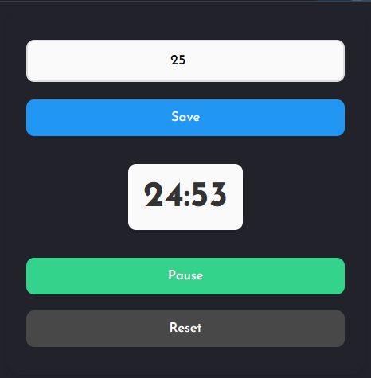
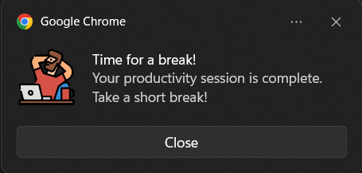

# Tick Task Tock (Productivity Timer)
A chrome extension to stay focused and boost productivity with customizable work and break timers.

## Screenshots

---

## Features

- **Customizable Timer**: Set your desired duration for focused work sessions.
<!-- - **Pomodoro Technique**: Supports Pomodoro-style work sessions (e.g., 25 minutes of focus, followed by a 5-minute break). -->
- **Notifications**: Get notified when your timer finishes, reminding you to take a break.
- **Timer in Icon**: The remaining time is shown directly on the extension icon, even when the popup is closed.
- **Simple Interface**: Control your timer with simple start, stop, and reset buttons.
- **Background Timer**: The timer continues running even when the popup is closed.
---

## Installation

1. **Download the Extension**
   - If you're a developer, you can load the extension locally by following these steps:
     1. Clone or download this repository to your local machine.
     2. Open **Chrome** and go to `chrome://extensions/`.
     3. Enable **Developer mode** by toggling the switch in the top-right corner.
     4. Click **Load unpacked** and select the folder where you downloaded/cloned the repository.
---
## Example Usage

1. **Set the Timer Duration**:  
   - Open the extension and set a timer for 25 minutes (ideal for Pomodoro).
  
2. **Start the Timer**:  
   - Click the **Start Timer** button and focus on your work for 25 minutes.
   
3. **See the Countdown**:  
   - As the timer runs, you'll see the remaining time on the extension icon.
   
4. **Take a Break**:  
   - When the timer finishes, you’ll get a notification reminding you to take a short break (5 minutes).
   
5. **Reset or Stop the Timer**:  
   - Once you’re done, click **Stop Timer** or **Reset Timer** to restart your session.
---

## Contributing

If you'd like to contribute to this extension, feel free to fork the repository and create a pull request with any improvements. Contributions are welcome!

### Dependencies

- **Chrome API**: Utilizes Chrome Extensions APIs for managing background tasks and notifications.
- **OffscreenCanvas**: Used for drawing the timer on the extension icon.

